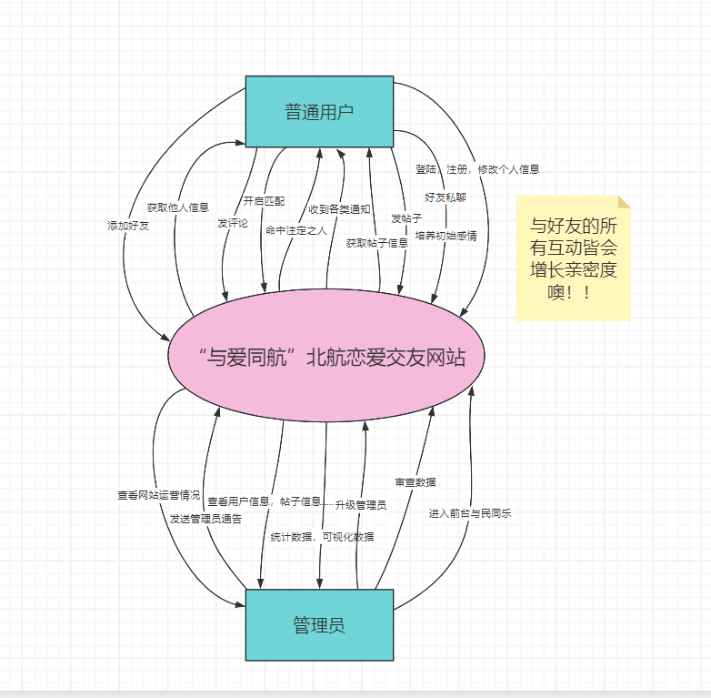

# 系统设计文档
## 一. 需求分析
### 1.1 需求描述 
#### 1.1.1 背景调研
大学生进入大学以后，随着心理和生理的逐渐成熟，加之大学学习，生活压力减小，课余时间相对增多，
大学生们会开始春心萌动，对异性产生爱慕之情，据统计相当大部分的大学生在大学最想得到的便是一场甜甜的恋爱，
却由于各种阻碍的屡屡碰壁，使大家纷纷变成了“看破红尘，专心学术”的卷卷怪，这些阻碍包括但不限于，兴趣爱好不合，性格不合，聊不到一起去，
人品不行，被渣男/渣女伤害，甚至有人“出师未捷身先死”，永远嘴上说着想找一个志同道合的恋人，却又永远由于各种原因跨不出最关键的第一步。

无论如何，整体大学生的恋爱情况稳中向好，无需我们过度担心。回归到日夜陪伴我们的母校，北京航天航空大学，一所纯正的理工科大学，一间纯正的人才加工厂。
一进入到你航就仿佛徜徉在了知识的海洋，在如此情况下，大学生的恋爱问题日益突出，据开发组人员就六系计算机学院众人的恋爱经历与态度统计，有**68**%的人从未谈过恋爱，
有23%的人正在谈恋爱，其余人并不愿意透露更多信息，猜测是受到过情伤；而进一步对68%并未谈过恋爱的同学进行调查，**87**%的同学对爱情充满着向往，进一步探寻原因，
其中**37**%的同学认为在六系难以接触更多的异性而自身并未积极行动，**27**%的同学的伴侣要求较高，难以找到兴趣相投三观相投的伴侣，**20**%的同学认为在六系压力过大，
更无从谈起恋爱，其余部分人还存在诸如认为自己交际能力差，容貌焦虑等等因自身原因而不敢开启一段恋爱的情况；
另外13%未谈过恋爱的同学似乎对爱情并无渴望，看似清心寡欲，然而这类人同样将是我们的受众群体。

即使六系同学们并不能完全代表北航的整体情况，但仍具备不小参考价值。我们认为一个面向北航在校大学生的安全，自由，便捷的在线恋爱交友平台值得被开发并加以推广。

### 1.1.2 用户画像
本网站将**自由**作为核心主旨，我们的用户身份仅划分两类，一是使用网站进行各项活动的**普通用户**，二是网站的**运维管理人员(下称管理员)**。

#### 1.1.3 用户需求
根据总结，我们对于北航用户的用户需求整理有下：
1. 能够接触到较多志同道合的异性
2. 能够频繁进行沟通(忽略微信，qq等交友软件)
3. 能够全方位展示自己，发表自己关于恋爱或其他事情的想法观点，并被青睐你的人发现
4. 拥有足够的社交属性
5. 希望存在命中注定的缘分，来与另一半梦幻相遇

#### 1.1.4 其他需求
同样，对于一个完整的网站，仅考虑用户需求过于片面，我们同样需要针对网站开发，维护，管理层面进行考量，总结其他需求如下。
1. 网站安全性需要得到保证，即使我们并未过多涉及敏感信息
2. 网站管理员能够查看各类统计信息
3. 网站管理员需要对用户相关数据信息进行管理，审查，删除等操作
4. 用户之间的交互需要被及时通知
5. 其他功能应与大多社交平台保持一致

#### 1.1.5 设计理想
我们与爱同行开发组鼓励同学们在大学在学习之余积极参与社交活动，积极勇敢追求中意的对象，使自己的大学生活留下一抹青春靓丽的痕迹。
我们同样对北航当下情况深表惋惜，并励志对北航六系乃至全北航的恋爱环境做出变化，为北航同学搭建出一个安全、健康、方便的在线恋爱交友平台，
以促进交友和校园内的恋爱文化，满足大学生的社交需求。

在设计过程中，我们参考了微博，抖音，B站等社交网站，Soul，青藤之恋，陌陌等恋爱交友网站，
并加以融会贯通进我们的平台，希望我们的恋爱交友平台能够得到大家的使用与信赖。

制作组成员Yang(杨博文)，morningTxT(苗汀昕)，Yukiemi(张宇骏)致上。
### 1.2 数据流图
#### 1.2.1 用户注册登录数据流图

#### 1.2.2 用户维护个人信息数据流图

#### 1.2.3 用户间私密交友数据流图

#### 1.2.4 用户间公共社交数据流图

#### 1.2.5 网站管理数据流图

#### 1.2.6 网站整体数据流图

### 1.3 数据元素表(附建表SQL)
共计15张表，为简便起见，我们每张表的主码皆为一个自增id，后续会建立其他候选码的索引。

#### 1.3.1 用户个人信息
**User**: 用户基本信息

| 字段名称          | 数据类型         | 可否为空       | 默认   | 说明   |
|---------------|--------------|------------|------|------|
| id            | int          | NO         | 无    | 主键id |
| username      | varchar(50)  | NO         | 无    | 姓名   |
| studentId     | varchar(50)  | NO         | 无    | 学号   | 
| password      | varchar(50)  | NO         | 无    | 密码   | 
| time          | datetime     | NO         | NOW  | 注册时间 |
| major         | varchar(50)  | NO         | 无    | 专业名  |
| nickname      | varchar(50)  | NO         | 无    | 昵称   | 
| avatarurl     | varchar(255) | NO(设置默认头像) | 无    | 头像链接 |
| backgroundUrl | varchar(255) | NO(设置默认背景) | 无    | 背景链接 |
| sex           | varchar(2)   | NO         | 无    | 性别   |
| signature     | varchar(50)  | YES        | 无    | 个性签名 |
| address       | varchar(50)  | NO         | 无    | 家乡   |
| birthday      | timestamp    | NO         | 无    | 生日   |
| role          | varchar(10)  | NO         | 普通用户 | 角色   |

创建表SQL:
    
    CREATE TABLE `user` (
        `id` int(11) NOT NULL AUTO_INCREMENT COMMENT '用户id',
        `username` varchar(50) COLLATE utf8mb4_unicode_ci DEFAULT NULL COMMENT '用户姓名',
        `password` varchar(50) COLLATE utf8mb4_unicode_ci DEFAULT NULL COMMENT '用户密码',
        `major` varchar(50) COLLATE utf8mb4_unicode_ci DEFAULT NULL COMMENT '用户专业',
        `studentId` varchar(50) COLLATE utf8mb4_unicode_ci DEFAULT NULL COMMENT '学号',
        `nickname` varchar(50) COLLATE utf8mb4_unicode_ci DEFAULT NULL COMMENT '昵称',
        `avatarUrl` varchar(255) COLLATE utf8mb4_unicode_ci DEFAULT NULL COMMENT '头像Url',
        `backgroundUrl` varchar(255) COLLATE utf8mb4_unicode_ci DEFAULT NULL COMMENT '空间背景Url',
        `sex` varchar(2) COLLATE utf8mb4_unicode_ci DEFAULT NULL COMMENT '性别',
        `signature` varchar(50) COLLATE utf8mb4_unicode_ci DEFAULT NULL COMMENT '个性签名',
        `address` varchar(50) COLLATE utf8mb4_unicode_ci DEFAULT NULL COMMENT '地址，精确到省',
        `grade` varchar(50) COLLATE utf8mb4_unicode_ci DEFAULT NULL COMMENT '年级',
        `birthday` timestamp NULL DEFAULT NULL COMMENT '出生日期',
        `role` varchar(10) COLLATE utf8mb4_unicode_ci DEFAULT '普通用户' COMMENT '用户权限',
        `time` datetime DEFAULT CURRENT_TIMESTAMP COMMENT '注册时间',
        PRIMARY KEY (`id`) USING BTREE
        ) ENGINE=InnoDB AUTO_INCREMENT=152 DEFAULT CHARSET=utf8mb4 COLLATE=utf8mb4_unicode_ci;

**Label**: 用户标签

| 字段名称   | 数据类型        | 可否为空 | 默认 | 说明   |
|--------|-------------|---------|----|------|
| id     | int         | NO      | 无  | 主键id |
| type   | varchar(50) | NO      | 无  | 标签类别 |
| name   | varchar(50) | NO      | 无  | 标签名称 |
| weight | double      | NO      | 无  | 标签权重 |

创建表SQL:

    CREATE TABLE `label` (
        `id` int(11) NOT NULL AUTO_INCREMENT COMMENT 'id',
        `type` varchar(50) COLLATE utf8mb4_unicode_ci DEFAULT NULL COMMENT '标签类型',
        `name` varchar(50) COLLATE utf8mb4_unicode_ci DEFAULT NULL COMMENT '标签名称',
        `weight` double DEFAULT '1',
        PRIMARY KEY (`id`) USING BTREE
        ) ENGINE=InnoDB AUTO_INCREMENT=93 DEFAULT CHARSET=utf8mb4 COLLATE=utf8mb4_unicode_ci;

**Label2User**: 用户与标签间关系

| 字段名称    | 数据类型   | 可否为空 | 默认 | 说明   | 外键      | 
|---------|--------|---------|----|------|---------|
| id      | int    | NO      | 无  | 主键id |         |
| userId  | int    | NO      | 无  | 用户id | user.id |
| labelId | int    | NO      | 无  | 标签id | label.id |

创建表SQL:
    
    CREATE TABLE `label2user` (
        `id` int(11) NOT NULL AUTO_INCREMENT COMMENT 'id',
        `userId` int(11) DEFAULT NULL COMMENT 'uid',
        `labelId` int(11) DEFAULT NULL COMMENT 'lid',
        PRIMARY KEY (`id`) USING BTREE,
        KEY `fk_1` (`userId`),
        KEY `fk_2` (`labelId`),
        CONSTRAINT `fk_1` FOREIGN KEY (`userId`) REFERENCES `user` (`id`) ON DELETE SET NULL ON UPDATE SET NULL,
        CONSTRAINT `fk_2` FOREIGN KEY (`labelId`) REFERENCES `label` (`id`) ON DELETE SET NULL ON UPDATE SET NULL
        ) ENGINE=InnoDB AUTO_INCREMENT=40 DEFAULT CHARSET=utf8mb4 COLLATE=utf8mb4_unicode_ci;

**ImageBoard**: 用户照片墙(图片与用户间联系)

| 字段名称   | 数据类型         | 可否为空 | 默认  | 说明   | 外键      |
|--------|--------------|---------|-----|------|---------|
| id     | int          | NO      | 无   | 主键id |         |
| userId | int          | NO      | 无   | 用户id | user.id |
| imgUrl | varchar(255) | NO      | 无   | 图片链接 |         |
| time   | datetime     | NO      | NOW | 上传时间 |         |

创建表SQL:

    CREATE TABLE `imageboard` (
        `id` int(11) NOT NULL AUTO_INCREMENT,
        `userId` int(11) DEFAULT NULL,
        `imgUrl` varchar(255) COLLATE utf8mb4_unicode_ci DEFAULT NULL,
        `time` datetime DEFAULT CURRENT_TIMESTAMP COMMENT '根据当前时间戳更新？',
        PRIMARY KEY (`id`),
        KEY `f1` (`userId`),
        CONSTRAINT `f1` FOREIGN KEY (`userId`) REFERENCES `user` (`id`)
        ) ENGINE=InnoDB AUTO_INCREMENT=18 DEFAULT CHARSET=utf8mb4 COLLATE=utf8mb4_unicode_ci;

#### 1.3.2 用户交互信息

**Post**: 帖子信息

| 字段名称       | 数据类型       | 可否为空 | 默认  | 说明              | 外键      |
|------------|------------|---------|-----|-----------------|---------|
| id         | int        | NO      | 无   | 主键id            |         |
| time       | datetime   | NO      | NOW | 发帖时间            |         |
| type       | tinyint    | NO      | 无   | 类型(公开至广场/仅个人空间可见) |         |
| content    | varchar(10000) | NO      | 无   | 内容              |         |
| top        | tinyint    | NO      | 0   | 是否个人空间内置顶       |         |
| userId     | int        | NO      | 无   | 发表用户id          | user.id |
| likeNum    | int        | NO      | 0   | 点赞量             |
| clickNum   | int        | NO      | 0   | 访问量             |
| commentNum | int        | NO      | 0   | 一级评论量           |

创建表SQL:

    CREATE TABLE `post` (
        `id` int(11) NOT NULL AUTO_INCREMENT COMMENT '帖子Id',
        `time` datetime DEFAULT CURRENT_TIMESTAMP COMMENT '发帖时间',
        `content` varchar(10000) COLLATE utf8mb4_unicode_ci DEFAULT NULL,
        `type` tinyint(1) DEFAULT NULL,
        `likeNum` int(11) unsigned zerofill DEFAULT '00000000000' COMMENT '点赞数',
        `clickNum` int(11) unsigned zerofill DEFAULT '00000000000' COMMENT '访问数',
        `top` tinyint(1) unsigned zerofill DEFAULT '0' COMMENT '1代表置顶 0代表不置顶',
        `userId` int(11) DEFAULT NULL COMMENT '用户Id',
        `commentNum` int(11) unsigned zerofill DEFAULT '00000000000',
        PRIMARY KEY (`id`),
        KEY `user_id` (`userId`),
        CONSTRAINT `user_id` FOREIGN KEY (`userId`) REFERENCES `user` (`id`) ON DELETE NO ACTION ON UPDATE NO ACTION
        ) ENGINE=InnoDB AUTO_INCREMENT=27 DEFAULT CHARSET=utf8mb4 COLLATE=utf8mb4_unicode_ci;

**Comment**: 评论信息

| 字段名称           | 数据类型        | 可否为空 | 默认  | 说明       | 外键         |
|----------------|-------------|------|-----|----------|------------|
| id             | int         | NO   | 无   | 主键id     |            |
| time           | datetime    | NO   | NOW | 评论时间     |            |
| userId         | int         | NO   | 无   | 评论用户id   | user.id    |
| replyCommentId | int         | YES  | 无   | 评论的评论id  | comment.id |
| replyPostId    | int         | NO   | 无   | 评论的帖子id  | post.id    |
| showId         | int         | YES  | 无   | 展示在哪条评论下 | comment.id |
| content        | varchar(255) | NO   | 无   | 评论内容     |            |
| likeNum        | int         | NO   | 0   | 点赞量      |            |
| commentNum     | int         | NO   | 0   | 评论量      |            |

创建表SQL:

    CREATE TABLE `comment` (
        `id` int(11) NOT NULL AUTO_INCREMENT,
        `userId` int(11) DEFAULT NULL,
        `time` datetime DEFAULT NULL,
        `replyCommentId` int(11) DEFAULT NULL,
        `replyPostId` int(11) DEFAULT NULL,
        `content` varchar(255) COLLATE utf8mb4_unicode_ci DEFAULT NULL,
        `likeNum` int(11) DEFAULT '0',
        `showId` int(11) DEFAULT NULL,
        `commentNum` int(11) DEFAULT '0',
        PRIMARY KEY (`id`),
        KEY `fk_11` (`userId`),
        KEY `fk_21` (`replyCommentId`),
        KEY `fk_31` (`replyPostId`),
        KEY `fk_4` (`showId`),
        CONSTRAINT `fk_11` FOREIGN KEY (`userId`) REFERENCES `user` (`id`) ON DELETE SET NULL ON UPDATE SET NULL,
        CONSTRAINT `fk_21` FOREIGN KEY (`replyCommentId`) REFERENCES `comment` (`id`) ON DELETE SET NULL ON UPDATE SET NULL,
        CONSTRAINT `fk_31` FOREIGN KEY (`replyPostId`) REFERENCES `post` (`id`) ON DELETE SET NULL ON UPDATE SET NULL,
        CONSTRAINT `fk_4` FOREIGN KEY (`showId`) REFERENCES `comment` (`id`) ON DELETE SET NULL ON UPDATE SET NULL
        ) ENGINE=InnoDB AUTO_INCREMENT=141 DEFAULT CHARSET=utf8mb4 COLLATE=utf8mb4_unicode_ci;

**Image2Post**: 帖子图片信息

| 字段名称   | 数据类型         | 可否为空 | 默认 | 说明   | 外键      |
|--------|--------------|------|----|------|---------|
| id     | int          | NO   | 无  | 主键id |         |
| postId | int          | NO   | 无  | 帖子id | post.id |
| imgUrl | varchar(255) | NO   | 无  | 图片链接 |  |

创建表SQL:

    CREATE TABLE `image2post` (
        `id` int(11) NOT NULL AUTO_INCREMENT,
        `postId` int(11) DEFAULT NULL,
        `imgUrl` varchar(255) COLLATE utf8mb4_unicode_ci DEFAULT NULL,
        PRIMARY KEY (`id`),
        KEY `fk_post` (`postId`),
        CONSTRAINT `fk_post` FOREIGN KEY (`postId`) REFERENCES `post` (`id`) ON DELETE SET NULL ON UPDATE SET NULL
        ) ENGINE=InnoDB AUTO_INCREMENT=22 DEFAULT CHARSET=utf8mb4 COLLATE=utf8mb4_unicode_ci;

**Like2Post**: 帖子与点赞间关系

| 字段名称   | 数据类型 | 可否为空 | 默认 | 说明   | 外键      |
|--------|------|------|----|------|---------|
| id     | int  | NO   | 无  | 主键id |         |
| postId | int  | NO   | 无  | 帖子id | post.id |
| userId | int  | NO   | 无  | 用户id | user.id |

创建表SQL:

    CREATE TABLE `like2post` (
        `id` int(11) NOT NULL AUTO_INCREMENT,
        `postId` int(11) DEFAULT NULL,
        `userId` int(11) DEFAULT NULL,
        PRIMARY KEY (`id`),
        KEY `fk_like2post_1` (`userId`),
        KEY `fk_like2post_2` (`postId`),
        CONSTRAINT `fk_like2post_1` FOREIGN KEY (`userId`) REFERENCES `user` (`id`) ON DELETE SET NULL ON UPDATE SET NULL,
        CONSTRAINT `fk_like2post_2` FOREIGN KEY (`postId`) REFERENCES `post` (`id`) ON DELETE SET NULL ON UPDATE SET NULL
        ) ENGINE=InnoDB AUTO_INCREMENT=464 DEFAULT CHARSET=utf8mb4 COLLATE=utf8mb4_unicode_ci;

**Like2Comment**: 评论与点赞间关系

| 字段名称      | 数据类型 | 可否为空 | 默认 | 说明   | 外键         |
|-----------|------|------|----|------|------------|
| id        | int  | NO   | 无  | 主键id |            |
| commentId | int  | NO   | 无  | 评论id | comment.id |
| userId    | int  | NO   | 无  | 用户id | user.id    |

创建表SQL:

    CREATE TABLE `like2comment` (
        `id` int(11) NOT NULL AUTO_INCREMENT,
        `commentId` int(11) DEFAULT NULL,
        `userId` int(11) DEFAULT NULL,
        PRIMARY KEY (`id`),
        KEY `fk_like2comment_1` (`commentId`),
        KEY `fk_like2comment_2` (`userId`),
        CONSTRAINT `fk_like2comment_1` FOREIGN KEY (`commentId`) REFERENCES `comment` (`id`) ON DELETE SET NULL ON UPDATE SET NULL,
        CONSTRAINT `fk_like2comment_2` FOREIGN KEY (`userId`) REFERENCES `user` (`id`) ON DELETE SET NULL ON UPDATE SET NULL
        ) ENGINE=InnoDB AUTO_INCREMENT=186 DEFAULT CHARSET=utf8mb4 COLLATE=utf8mb4_unicode_ci;

**Friend**: 好友信息

| 字段名称        | 数据类型     | 可否为空 | 默认  | 说明      | 外键           |
|-------------|----------|------|-----|---------|--------------|
| id          | int      | NO   | 无   | 主键id    |              |
| userId1     | int      | NO   | 无   | 好友一方id  | user.id      |
| userId2     | int      | NO   | 无   | 好友另一方id | user.id      |
| intimacy    | int      | NO   | 0   | 好友亲密度   |              |
| time        | datetime | NO   | NOW | 成为好友时间  |              |
| soulMatchId | int      | YES  | 无   | 灵魂匹配id  | soulMatch.id |

创建表SQL:

    CREATE TABLE `friend` (
        `id` int(11) NOT NULL AUTO_INCREMENT,
        `userId1` int(11) DEFAULT NULL,
        `userId2` int(11) DEFAULT NULL,
        `intimacy` int(11) DEFAULT '0',
        `time` datetime DEFAULT NULL COMMENT '双方成为好友的时间',
        `soulMatchId` int(11) DEFAULT NULL,
        PRIMARY KEY (`id`),
        KEY `fk_friend_1` (`userId1`),
        KEY `fk_friend_2` (`userId2`),
        KEY `fk_friend_3` (`soulMatchId`),
        CONSTRAINT `fk_friend_1` FOREIGN KEY (`userId1`) REFERENCES `user` (`id`) ON DELETE SET NULL ON UPDATE SET NULL,
        CONSTRAINT `fk_friend_2` FOREIGN KEY (`userId2`) REFERENCES `user` (`id`) ON DELETE SET NULL ON UPDATE SET NULL,
        CONSTRAINT `fk_friend_3` FOREIGN KEY (`soulMatchId`) REFERENCES `soulmatch` (`id`) ON DELETE SET NULL ON UPDATE SET NULL
        ) ENGINE=InnoDB AUTO_INCREMENT=24 DEFAULT CHARSET=utf8mb4 COLLATE=utf8mb4_unicode_ci;

**Chat**: 好友间聊天信息

| 字段名称       | 数据类型         | 可否为空 | 默认  | 说明     | 外键           |
|------------|--------------|------|-----|--------|--------------|
| id         | int          | NO   | 无   | 主键id   |              |
| senderId   | int          | NO   | 无   | 发送者id  | user.id      |
| receiverId | int          | NO   | 无   | 接收者id  | user.id      |
| content    | varchar(255) | NO   | 无   | 聊天内容   |              |
| time       | datetime     | NO   | NOW | 发送消息时间 |              |
| read       | tinyint      | NO   | 0   | 是否已读   |  |

创建表SQL:

    CREATE TABLE `chat` (
        `id` int(11) NOT NULL AUTO_INCREMENT,
        `time` datetime DEFAULT NULL,
        `senderId` int(11) DEFAULT NULL,
        `receiverId` int(11) DEFAULT NULL,
        `content` varchar(255) COLLATE utf8mb4_unicode_ci DEFAULT NULL,
        `read` tinyint(4) DEFAULT '0',
        PRIMARY KEY (`id`),
        KEY `fk_chat_1` (`senderId`),
        KEY `fk_chat_2` (`receiverId`),
        CONSTRAINT `fk_chat_1` FOREIGN KEY (`senderId`) REFERENCES `user` (`id`) ON DELETE SET NULL ON UPDATE SET NULL,
        CONSTRAINT `fk_chat_2` FOREIGN KEY (`receiverId`) REFERENCES `user` (`id`) ON DELETE SET NULL ON UPDATE SET NULL
        ) ENGINE=InnoDB AUTO_INCREMENT=127 DEFAULT CHARSET=utf8mb4 COLLATE=utf8mb4_unicode_ci;

**SoulMatch**: 灵魂匹配信息(**核心机制**)

| 字段名称               | 数据类型     | 可否为空 | 默认  | 说明       | 外键           |
|--------------------|----------|------|-----|----------|--------------|
| id                 | int      | NO   | 无   | 主键id     |              |
| userId             | int      | NO   | 无   | 用户id     | user.id      |
| matchNum           | int      | NO   | 无   | 匹配数量     |       |
| sendApplicationNum | int      | NO   | 0   | 发送请求数量   |              |
| successNum         | int      | NO   | 0   | 成功添加好友数量 |              |
| time               | datetime | NO   | NOW | 发起时间     |  |

创建表SQL:

    CREATE TABLE `soulmatch` (
        `id` int(11) NOT NULL AUTO_INCREMENT,
        `userId` int(11) DEFAULT NULL,
        `matchNum` int(11) DEFAULT NULL,
        `sendApplicationNum` int(11) DEFAULT '0',
        `successNum` int(11) DEFAULT '0',
        `time` datetime DEFAULT CURRENT_TIMESTAMP,
        PRIMARY KEY (`id`),
        KEY `fk_soul_1` (`userId`),
        CONSTRAINT `fk_soul_1` FOREIGN KEY (`userId`) REFERENCES `user` (`id`) ON DELETE SET NULL ON UPDATE SET NULL
        ) ENGINE=InnoDB AUTO_INCREMENT=38 DEFAULT CHARSET=utf8mb4 COLLATE=utf8mb4_unicode_ci;
#### 1.3.3 全方位覆盖通知信息
**Notice**: 涵盖各类型的通知信息，包括添加好友信息(friend)，成功添加好友信息(success)，收到回复信息(reply)，收到点赞信息(like)，管理员通告信息(system)。

| 字段名称                  | 数据类型     | 可否为空 | 默认  | 说明          | 外键                     |
|-----------------------|----------|------|-----|-------------|------------------------|
| id                    | int      | NO   | 无   | 主键id        |                        |
| type                  | varchar(20) | NO   | 无   | 通知类型        |                        |
| time                  | datetime | NO   | NOW | 发送消息时间      |                        |
| read                  | tinyint  | NO   | 0   | 是否已读        |                        |
| message               | varchar(255) | NO   | 无   | 通知内容        |                        |
| isDelete              | tinyint  | NO   | 0   | 是否假删除       |                        |
| receiverId            | int      | NO   | 无   | 接收方用户id     | user.id                |
| senderId              | int      | NO   | 无   | 发送方用户id     | user.id                |
| replyPostId           | int      | YES  | 无   | 被回复/评论的帖子id | post.id                |
| replyCommentId        | int      | YES  | 无   | 被回复/评论的评论id | comment.id             |
| senderCommentId       | int      | YES  | 无   | 回复/评论的评论id  | comment.id             |
| managerAnnouncementId | int      | YES  | 无   | 管理员通告id     | managerAnnouncement.id |
| managerAnnouncementId | int      | YES  | 无   | 灵魂匹配事件id    | soulMatch.id           |

**注**: 本实体将多种通知类型糅合进一张表中，根据通知类型使用不同的外键描述，如此做减少了思考难度与设计难度，但增大了表的存储空间。

创建表SQL:

    CREATE TABLE `notice` (
        `id` int(11) NOT NULL AUTO_INCREMENT,
        `type` varchar(20) COLLATE utf8mb4_unicode_ci DEFAULT NULL COMMENT '好友 or 点赞 or 评论 or 管理员公告',
        `time` datetime DEFAULT NULL,
        `receiverId` int(11) DEFAULT NULL COMMENT '接收者user',
        `senderId` int(11) DEFAULT NULL,
        `read` tinyint(4) DEFAULT '0',
        `replyPostId` int(11) DEFAULT NULL,
        `message` varchar(255) COLLATE utf8mb4_unicode_ci DEFAULT NULL COMMENT '通知信息',
        `replyCommentId` int(11) DEFAULT NULL,
        `senderCommentId` int(11) DEFAULT NULL,
        `managerAnnouncementId` int(11) DEFAULT NULL,
        `isDelete` tinyint(1) unsigned DEFAULT '0',
        `soulMatchId` int(11) DEFAULT NULL,
        PRIMARY KEY (`id`),
        KEY `fk_notice_1` (`senderId`),
        KEY `fk_notice_2` (`receiverId`),
        KEY `fk_notice_3` (`replyPostId`),
        KEY `fk_notice_4` (`replyCommentId`),
        KEY `fk_notice_5` (`senderCommentId`),
        KEY `fk_notice_6` (`managerAnnouncementId`),
        KEY `fk_notice_7` (`soulMatchId`),
        CONSTRAINT `fk_notice_1` FOREIGN KEY (`senderId`) REFERENCES `user` (`id`) ON DELETE SET NULL ON UPDATE SET NULL,
        CONSTRAINT `fk_notice_2` FOREIGN KEY (`receiverId`) REFERENCES `user` (`id`) ON DELETE SET NULL ON UPDATE SET NULL,
        CONSTRAINT `fk_notice_3` FOREIGN KEY (`replyPostId`) REFERENCES `post` (`id`) ON DELETE SET NULL ON UPDATE SET NULL,
        CONSTRAINT `fk_notice_4` FOREIGN KEY (`replyCommentId`) REFERENCES `comment` (`id`) ON DELETE SET NULL ON UPDATE SET NULL,
        CONSTRAINT `fk_notice_5` FOREIGN KEY (`senderCommentId`) REFERENCES `comment` (`id`) ON DELETE SET NULL ON UPDATE SET NULL,
        CONSTRAINT `fk_notice_6` FOREIGN KEY (`managerAnnouncementId`) REFERENCES `managerannouncement` (`id`) ON DELETE SET NULL ON UPDATE SET NULL,
        CONSTRAINT `fk_notice_7` FOREIGN KEY (`soulMatchId`) REFERENCES `soulmatch` (`id`) ON DELETE SET NULL ON UPDATE SET NULL
        ) ENGINE=InnoDB AUTO_INCREMENT=494 DEFAULT CHARSET=utf8mb4 COLLATE=utf8mb4_unicode_ci;

**ManagerAnnouncement**: 管理员公告信息

| 字段名称        | 数据类型         | 可否为空 | 默认  | 说明            | 外键 |
|-------------|--------------|------|-----|---------------|--|
| id          | int          | NO   | 无   | 主键id          |  |
| time        | datetime     | NO   | NOW | 公告时间          |  |
| userId      | int          | NO   | 无   | 管理员id         | user.id |
| message     | varchar(255) | NO   | 无   | 通告内容          |  |
| receiverNum | int          | NO   | 无   | 接收人数          |  |
| type        | varchar(20)  | NO   | 无   | 通告类型(部分人/所有人) |  |

创建表SQL:

    CREATE TABLE `managerannouncement` (
        `id` int(11) NOT NULL AUTO_INCREMENT,
        `time` datetime DEFAULT CURRENT_TIMESTAMP,
        `userId` int(11) DEFAULT NULL,
        `message` varchar(255) COLLATE utf8mb4_unicode_ci DEFAULT NULL,
        `receiverNum` int(11) DEFAULT NULL,
        `type` varchar(20) COLLATE utf8mb4_unicode_ci DEFAULT NULL,
        PRIMARY KEY (`id`),
        KEY `fk_ma_1` (`userId`),
        CONSTRAINT `fk_ma_1` FOREIGN KEY (`userId`) REFERENCES `user` (`id`) ON DELETE SET NULL ON UPDATE SET NULL
        ) ENGINE=InnoDB AUTO_INCREMENT=12 DEFAULT CHARSET=utf8mb4 COLLATE=utf8mb4_unicode_ci;

#### 1.3.4 访问量记录信息
**Access**: 记录各页面访问量信息

| 字段名称     | 数据类型        | 可否为空 | 默认  | 说明     | 外键           |
|----------|-------------|------|-----|--------|--------------|
| id       | int         | NO   | 无   | 主键id   |              |
| userId   | int         | NO   | 无   | 用户id   | user.id      |
| time     | datetime    | NO   | NOW | 发送消息时间 |              |
| pageName | varchar(50) | NO   | 无   | 页面名称   |      |

创建表SQL:

    CREATE TABLE `access` (
        `id` int(11) NOT NULL AUTO_INCREMENT,
        `userId` int(11) DEFAULT NULL,
        `time` datetime DEFAULT NULL,
        `pageName` varchar(50) COLLATE utf8mb4_unicode_ci DEFAULT NULL,
        PRIMARY KEY (`id`),
        KEY `fk_access_1` (`userId`),
        CONSTRAINT `fk_access_1` FOREIGN KEY (`userId`) REFERENCES `user` (`id`) ON DELETE SET NULL ON UPDATE SET NULL
        ) ENGINE=InnoDB AUTO_INCREMENT=991 DEFAULT CHARSET=utf8mb4 COLLATE=utf8mb4_unicode_ci;

## 二. 数据库概念模式设计
### 2.1 实体ER图
我们共划分十个实体。

### 2.2 模块关系ER图
我们将系统功能划分为四个模块：用户个人信息模块，用户与用户间交互模块(进一步拆分为私密交友模块与公共社交模块)，管理员管理模块。
#### 2.2.1 用户个人信息模块ER图
为美观起见，不再展示用户全部属性。

#### 2.2.2 私密交友模块ER图
!
#### 2.2.3 公共社交模块ER图
为美观起见，不再展示帖子所有属性

#### 2.2.4 管理员管理模块ER图

#### 2.2.5 模块总结
**通知**贯穿各模块，是最为复杂的机制，依赖于通知机制我们实现了用户间实时的可见的交互。通知的种类繁多，依赖外键较为复杂，ER图中无法全面展现，我们会在后续分析物理模型时进一步叙述，
总的来说，我们可以把通知机制理解为，**一个用户向另一个用户发送了一条信息**，其重点在于两个用户之间的关系。

### 2.3 系统整体ER图
由于过于庞大复杂，为美观起见，省略了部分属性。

## 三. 数据库逻辑模式设计
### 3.1 数据库关系模式
关系模式可以形式化表⽰为 $ R(U, D, DOM, F) $ 。$ U $ 为组成该关系的属性名，$ D $为 $ U $ 中属性所来⾃的域，
$ DOM $ 指的是属性与域的映射，$ F $ 指的是属性间的依赖关系集合。以下约定 $ I $ 表⽰int型，$ F $ 表⽰浮点数，$ S $ 为任意字符组成的字符串，$ T $ 表⽰时间，$ B $ 表⽰布尔值，由于上述已给出每个属性的类型，下文不对域再进行讨论。主码以下划线标识。

以下是由ER图推导并加以外键优化后最终得到的关系模式。

#### 3.1.1 实体(包含1对1，1对多关系)
一对一的关系将关系耦合进任意一方，一对多的关系将关系耦合进多的一方

1. User:
   user({<u>id</u>，username，studentId，password，time，major，nickname，avatarUrl，backgroundUrl，sex，signature，address，birthday，role}，D，Dom，F)
    
    **F**={id->其他属性，studentId->其他属性，(username，password)->其他属性}
    
    **外码**：无

    **候选码**: id，studentId，(username，password)
2. Label:
   label({<u>id</u>，type，name， weight}，D，Dom，F)

    **F**={id->其他属性，(type，name)->其他属性}

    **外码**：无

    **候选码**: id，(type，name)
3. ImageBoard:
   imageboard({<u>id</u>，userId，imgUrl，time}，D，Dom，F)

   **F**={id->其他属性，imgUrl->其他属性}

   **外码**：userId(user.id)

   **候选码**: id，imgUrl
4. Post:
   post({<u>id</u>，time，type，content，top，userId，likeNum，clickNum，commentNum}，D，Dom，F)
   
   **F**={id->其他属性}

   **外码**：userId(user.id)

   **候选码**: id
5. Comment:
   comment({<u>id</u>，time，userId，replyCommentId，replyPostId，showId，content，likeNum，commentNum}，D，Dom，F)
   
   **F**={id->其他属性}
   
   **当replyCommentId存在时存在 replyCommentId->replyPostId，但是由于replyCommentId可以为空，此时不存在函数依赖 replyCommentId->replyPostId。**

   **外码**：userId(user.id)

   **候选码**: id

6. Image2Post:
   image2post({<u>id</u>，postId，imgUrl}，D，Dom，F)

   **F**={id->其他属性，imgUrl->其他属性}

   **外码**：postId(post.id)

   **候选码**: id，imgUrl
7. Chat:
   chat({<u>id</u>，senderId，receiverId，content，time，read}，D，Dom，F)

   **F**={id->其他属性}

   **外码**：senderId(user.id)，receiverId(user.id)

   **候选码**: id
8. SoulMatch:
   soulMatch({<u>id</u>，userId，matchNum，sendApplicationNum，successNum，time}，D，Dom，F)

   **F**={id->其他属性}

   **外码**：userId(user.id)

   **候选码**: id
9. Notice:
   notice({<u>id</u>，type，time，read，message，isDelete，receiverId，senderId，replyPostId，replyCommentId，senderCommentId，managerAnnouncementId，soulMatchId}，D，Dom，F)

   **F**={id->其他属性}

   此表中由于涉及过多类型的通知而存在大量外键，senderId和receiverId是必须的外键，其余外键皆可以为空。或许会认为**replyPostId/replyCommentId->receiverId，senderCommentId/managerAnnouncementId->senderId**，然而在左侧外键为空时右侧外键不唯一，因此这些并不是函数依赖。

   **外码**：senderId，receiverId(user.id)，replyCommentId，senderCommentId(comment.id)，replyPostId(post.id)，managerAnnouncementId(managerannouncement.id)，soulmatchId(soulmatch.id)

   **候选码**: id
10. ManagerAnnouncement:
    managerAnnouncement({<u>id</u>，time，userId，message，receiverNum，type}，D，Dom，F)

    **F**={id->其他属性}

    **外码**： userId(user.id)

    **候选码**: id

#### 3.1.2 多对多关系
1. Label2User:
    label2user({<u>id</u>，userId，labelId}，D，Dom，F)

    **F**={id->其他属性，(userId，labelId)->其他属性}

    **外码**： userId(user.id)，labelId(label.id)

    **候选码**: id，(userId，labelId)
2. Like2Post:
   like2post({<u>id</u>，postId，userId}，D，Dom，F)

   **F**={id->其他属性，(postId，userId)->其他属性}

   **外码**：userId(user.id)，postId(post.id)

   **候选码**: id，(userId，postId)
3. Like2Comment:
   like2comment({<u>id</u>，commentId，userId}，D，Dom，F)

   **F**={id->其他属性，(commentId，userId)->其他属性}

   **外码**：userId(user.id)，commentId(comment.id)

   **候选码**: id，(userId，commentId)
4. Friend:
   friend({<u>id</u>，userId1，userId2，intimacy，time，soulMatchId}，D，Dom，F)

   **F**={id->其他属性，(userId1，userId2)->其他属性}

   **外码**：userId1(user.id)，userId2(user.id)

   **候选码**: id，(userId1，userId2)
5. Access:
   access({<u>id</u>，userId，time，pageName}，D，Dom，F)

   **F**={id->其他属性}

   **由于我们假定一个用户在同一时间可以多次访问同一界面，因此仅有id作为候选码**

   **外码**：userId(user.id)

   **候选码**: id

### 3.2 关系模式范式等级的判定
分别对上述表进行范式等级判断，我们仅检查到BCNF范式，将未达到3NF的表规范到3NF。

#### 3.2.1 实体等级判定
1. User: 仅存在三组候选码产生的依赖，满足对于所有函数依赖 $ X -> Y $，X都是码，因此user属于$ BCNF $，自然属于$ 3NF $。
2. Label: 仅存在两组候选码产生的依赖，满足对于所有函数依赖 $ X -> Y $，X都是码，因此label属于$ BCNF $，自然属于$ 3NF $。
3. ImageBoard: 仅存在两组候选码产生的依赖，满足对于所有函数依赖 $ X -> Y $，X都是码，因此label属于$ BCNF $，自然属于$ 3NF $。
4. Post: 所有函数依赖的左端均为主码，因此post属于$ BCNF $，自然属于$ 3NF $。
5. Comment: 所有函数依赖的左端均为主码，因此comment属于$ BCNF $，自然属于$ 3NF $。
6. Image2Post: 仅存在两组候选码产生的依赖，满足对于所有函数依赖 $ X -> Y $，X都是码，因此image2post属于$ BCNF $，自然属于$ 3NF $。
7. Chat: 所有函数依赖的左端均为主码，因此chat属于$ BCNF $，自然属于$ 3NF $。
8. SoulMatch: 所有函数依赖的左端均为主码，因此soulmatch属于$ BCNF $，自然属于$ 3NF $。 
9. notice: 所有函数依赖的左端均为主码，因此notice属于$ BCNF $，自然属于$ 3NF $。
10. ManagerAnnouncement: 所有函数依赖的左端均为主码，因此managerannouncement属于$ BCNF $，自然属于$ 3NF $。

#### 3.2.2 多对多关系等级判定
1. Label2User: 仅存在两组候选码产生的依赖，满足对于所有函数依赖 $ X -> Y $，X都是码，因此label2user属于$ BCNF $，自然属于$ 3NF $。 
2. Like2Post: 仅存在两组候选码产生的依赖，满足对于所有函数依赖 $ X -> Y $，X都是码，因此like2post属于$ BCNF $，自然属于$ 3NF $。
3. Like2Comment: 仅存在两组候选码产生的依赖，满足对于所有函数依赖 $ X -> Y $，X都是码，因此like2comment属于$ BCNF $，自然属于$ 3NF $。
4. Friend: 仅存在两组候选码产生的依赖，满足对于所有函数依赖 $ X -> Y $，X都是码，因此friend属于$ BCNF $，自然属于$ 3NF $。
5. Access: 所有函数依赖的左端均为主码，因此notice属于$ BCNF $，自然属于$ 3NF $。
   
#### 3.2.3 总结
我们的所有表均满足$BCNF$范式，自然全部满足$3NF$范式，具备了较成熟专业的数据库表设计能力。

### 3.3 数据库设计优化
为提高数据库增删改查的效率，以及简化开发人员的操作，我们对数据库的一些方面做出了优化。

#### 3.3.1 建立更多索引
数据库中有两类索引在创建时便会建好，分别为主键的索引与外键的索引。除此之外，对于表中其他候选码，又或是一些频繁查询的属性，我们也可以建立起索引增快查询速度。

如用户表中，我们还可以建立起学号的唯一索引与用户名密码的一般索引。

    CREATE UNIQUE INDEX index_studentId ON user(studentId);
    CREATE INDEX index_username ON user(username);
    CREATE INDEX index_password ON user(password);

以及一些多对多的关系中，我们经常给定一端求取与之对应的多条数据，我们可以在两端都建立起一般索引，如在like2post表中，对userId和postId分别建立索引，这样在查找指定用户点赞过哪些帖子和指定帖子被哪些用户点赞过时都可大幅提高效率。一般而言这类索引在设置外键时已自动设置，无需手动操作。

    KEY `fk_like2post_1` (`userId`)
    KEY `fk_like2post_2` (`postId`)

#### 3.3.2 优化查询语句
我们在后端编写SQL时时刻注重优化查询语句，减少数据的访问与查询次数。

* 避免使用SELECT *: 只选择需要的列，而不是使用SELECT *，避免冗余的数据传输。
* 优化连接操作：我们在执行连接操作时，要确保连接的字段中存在索引，同时注意要选择合适的连接类型，区分内连接与外连接的不同，避免逻辑错误。
* 减少嵌套子查询：在相关子查询中，对于主查询的每一行结果，子查询都需要被执行一次，加之子查询伴随着临时表的生成，大大降低了查询效率。我们尽可能使用连表操作替换子查询操作，或尝试拆分成多条SQL语句。

#### 3.3.3 创建视图
视图是实体表的映射，一般而言作用有二，一是展示出不同的外模式供不同角色的开发者使用，提高数据库安全性，在此不过多区分；二是简化复杂查询，如果我们经常需要执行复杂的查询，可以通过创建一个视图来隐藏这些复杂性，无需每次都编写复杂的SQL语句。

针对一些频繁查询的连表操作我们创建了视图，例如统计用户的好友数量时，涉及到连表和复杂的SQL，我们改为创建视图易于查询。

    CREATE VIEW user2friendnum AS
    SELECT
        COALESCE(f1.friend_count, 0) + COALESCE(f2.friend_count, 0) AS total_friend_count
    FROM
        `user` u
    LEFT JOIN (
        SELECT
            userId1,
            COUNT(*) AS friend_count
        FROM
            friend
        GROUP BY
            userId1
    ) f1 ON u.id = f1.userId1
    LEFT JOIN (
        SELECT
            userId2,
            COUNT(*) AS friend_count
        FROM
            friend
        GROUP BY
            userId2
    ) f2 ON u.id = f2.userId2;

统计用户使用灵魂匹配次数时:

    CREATE VIEW user2soulmatch AS 
    SELECT userId, count(userId) AS useTime 
    FROM soulmatch 
    GROUP BY userId

#### 3.3.4 使用触发器与函数
我们的表之间联动较多，在执行某项任务时可能同时涉及多个表的更新，为简化开发者逻辑，并充分利用数据库系统，我们使用了触发器和函数等功能，进一步优化数据库设计。

在给帖子点赞/撤销赞时更新帖子的点赞量：

    CREATE TRIGGER addPostLikeNum
    AFTER INSERT ON like2post
    FOR EACH ROW
    BEGIN
    SET @likenum := (SELECT likeNum from post WHERE id = new.postId); 
    UPDATE post SET likeNum = @likenum + 1 WHERE i

    CREATE TRIGGER delPostLikeNum
    BEFORE DELETE ON like2post
    FOR EACH ROW
    BEGIN
    SET @likenum := (SELECT likeNum from post WHERE id = old.postId); 
    UPDATE post SET likeNum = @likenum - 1 WHERE id = old.postId;
    ENDd = new.postId;
    END

在给评论点赞/撤销赞时更新评论的点赞量：

    CREATE TRIGGER addCommentLikeNum
    AFTER INSERT ON like2comment
    FOR EACH ROW
    BEGIN
    SET @likenum := (SELECT likeNum from `comment` WHERE id = new.commentId); 
    UPDATE `comment` SET likeNum = @likenum + 1 WHERE id = new.commentId;
    END

    CREATE TRIGGER delCommentLikeNum
    BEFORE DELETE ON like2comment
    FOR EACH ROW
    BEGIN
    SET @likenum := (SELECT likeNum from `comment` WHERE id = old.commentId); 
    UPDATE `comment` SET likeNum = @likenum - 1 WHERE id = old.commentId;
    END

帖子下发表/删除评论更新帖子的评论量：

    CREATE TRIGGER addCommentNum
    AFTER INSERT ON `comment`
    FOR EACH ROW
    BEGIN
    SET @commentnum := (SELECT commentNum from post WHERE id = new.replyPostId);
    IF new.replyCommentId IS NULL THEN
        UPDATE post SET commentNum = @commentnum + 1 WHERE id = new.replyPostId;
    END IF;
    END

    CREATE TRIGGER delCommentNum
    BEFORE DELETE ON `comment`
    FOR EACH ROW
    BEGIN
    SET @commentnum := (SELECT commentNum from post WHERE id = old.replyPostId);
    IF old.replyCommentId IS NULL THEN
        UPDATE post SET commentNum = @commentnum - 1 WHERE id = old.replyPostId;
    END IF;
    END

评论下增加评论时更新评论的评论量:

    CREATE TRIGGER addCommentNum2Comment
    AFTER INSERT ON `comment`
    FOR EACH ROW
    BEGIN
    SET @commentnum := (SELECT commentNum from `comment` WHERE new.replyCommentId is not null and id = new.replyCommentId);
    IF @commentnum IS NOT NULL THEN
        UPDATE `comment` SET commentNum = @commentnum + 1 WHERE id = new.replyCommentId;
    END IF;
    END

#### 3.3.5 严格约束加入数据库的数据
我们通过数据库建表时设置的外键约束(参见上文)和索引UNIQUE约束搭配前后端表单检查的方式，避免脏数据污染数据库，为开发人员造成不必要的麻烦。

同时在后续工作中可考虑使用触发器拦截更新，插入，删除请求，实现更加灵活更加便捷的约束。

#### 3.3.6 数据库日志
我们考虑开启数据库普通日志，来记录追踪用户的各项行为，便于对用户形象的统计刻画。

    set global general_log = 'ON';
    set global log_output = 'TABLE';
    set global general_log_file = 'log';
    set global general_log_table = dbhomework.log;

然而开启日志后伴随着占用存储空间变多同时执行效率降低，使我们不得不放弃了这个想法，进而转为综合各个表间信息来统合用户行为数据。